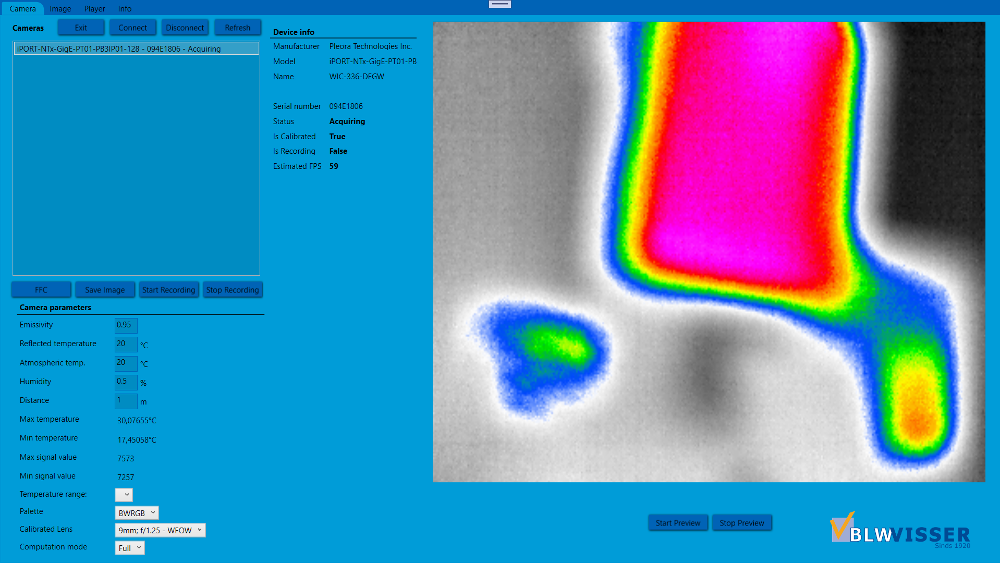
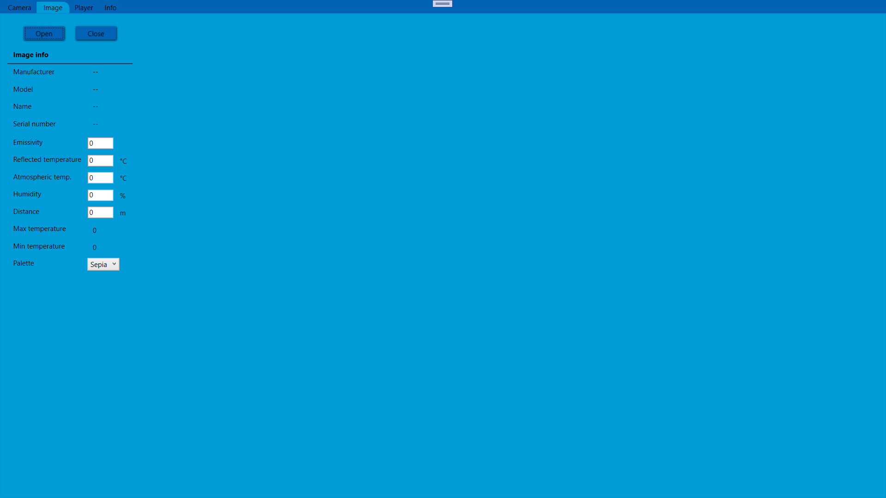
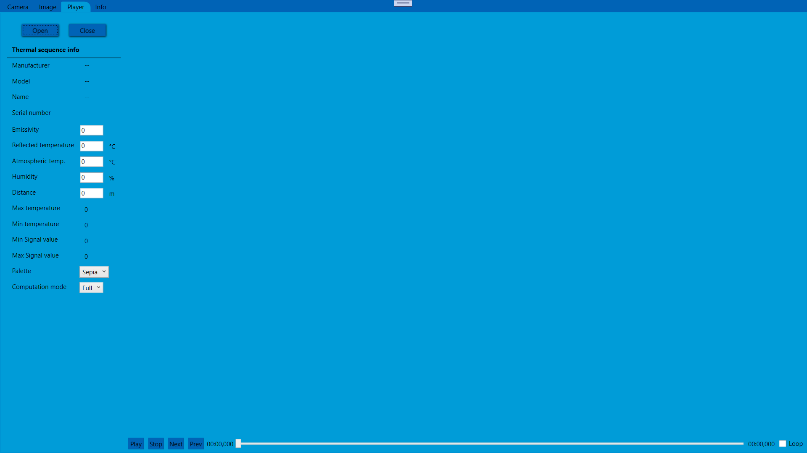
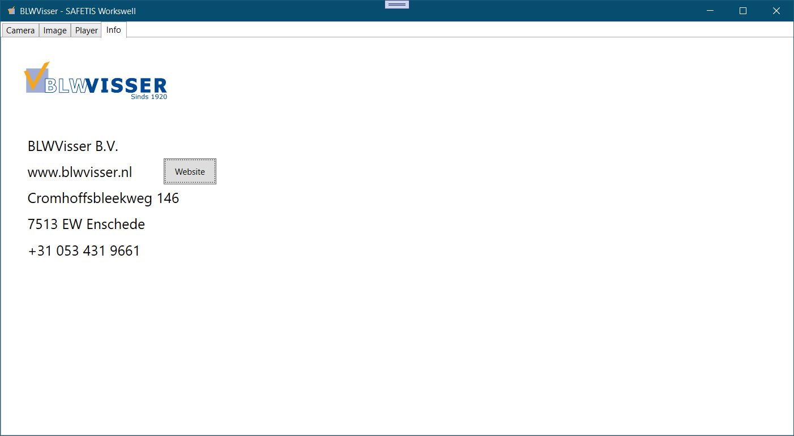

 

  
	<h1 align="center">BLWVISSER</h1>

  
<strong>Menu</strong>

	 
	<a href="https://blwvisser.nl"><strong>Website BLWVisser  »</strong></a>
	<a href="https://lucashuls.nl"><strong>Website Lucas Huls  »</strong></a>
	 

 

## Designs
<h1>Camera's Tab</h1>
 
<h1>Image Tab</h1>
 
<h1>Player Tab</h1>

<h1>Info Tab</h1>

## Contact
 
prive@lucashuls.nl / stg2@blwvisser.nl

## Links
Project Link: [https://github.com/LucasHuls/BLW-Visser-Windows](https://github.com/LucasHuls/BLW-Visser-Windows)
